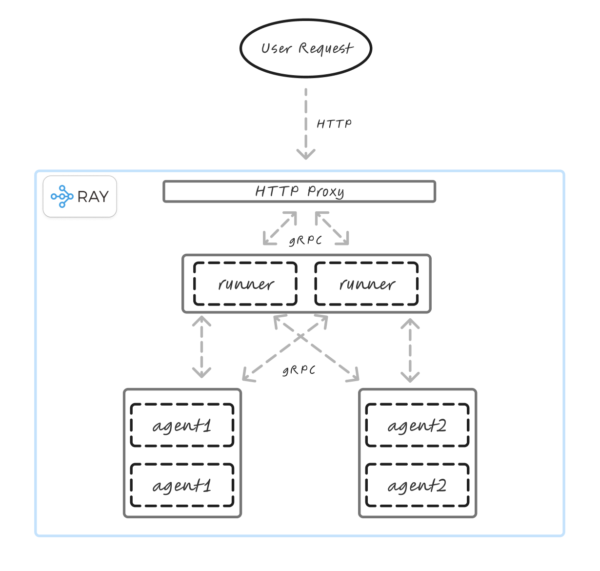

# Run and deploy using Ray Serve

*For an example of how to compile and execute your graphs using Ray Serve, see this notebook on [Deploying using Ray Serve](https://github.com/adam-h-ds/tinyagents/tree/add_ray_deployments/examples/deploy_with_ray.ipynb)*

TinyAgents graphs can be compiled as a [Ray Serve Application](https://docs.ray.io/en/latest/serve/api/doc/ray.serve.Application.html).

## How it works
* Each node within a TinyAgents graph becomes a seperate deployment within the Ray Serve Application. Nodes can therefore be scheduled (e.g. placement groups) and scaled independently. 
* A top-level deployment is provisioned called `runner` which acts as the entrypoint for executing the entire graph.
* There are no code changes needed to use this feature

See [Usage](#usage) for more information on how it works.

## Considerations
There are a few things to consider before using this feature:
1. **Installation** - TinyAgents will need to be installed/made available to Ray workers within the environment. TinyAgents does not explicity call `ray.init()` (however Ray will automatically provision a local cluster if this method is not called, or the `RAY_ADDRESS` environment variable is not found), therefore you are able to dynamically install the library (and any others that you may need) at runtime using:
    ```python
    import ray

    ray.init(runtime_env={"pip": ["tinyagents"]})
    ```

    alternatively, you can install your libraries into a custom KubeRay image (which is recommended for production). You can then override the following [values.yaml](https://github.com/ray-project/kuberay-helm/blob/bbde24accbfc842201d7c4c7e6d2e7ebb01bb69f/helm-chart/ray-cluster/values.yaml#L9) for official KubeRay Helm chart.

2. **Performance** - although TinyAgents provides support in building your Ray Serve Applications, it is important to consider how each of these deployments/nodes are configured (using the `ray_options` argument when calling `graph.compile()`). For example, you may see comparatively poor performance when running computationally-lightweight applications across multiple machines (e.g. scheduling the *runner* to run on a different machine to the nodes may result in additional networking latency). See [Configure Ray Serve Deployments](https://docs.ray.io/en/latest/serve/configure-serve-deployment.html) and [Best practices in production](https://docs.ray.io/en/latest/serve/production-guide/best-practices.html) for more guidance.


## Usage
Graphs can be converted to a Ray Serve Application by passing the `use_ray=True` argument to `graph.compile()` method.

```python
from tinyagents import chainable
from ray import serve

@chainable
class Agent1:
    name: str = "agent1"

    def __init__(self):
        ...

    def run(self, x):
        return ...

@chainable
class Agent2:
    name: str = "agent2"

    def __init__(self):
        ...

    def run(self, x):
        return ...

# define graph
graph = loop(Agent1(), Agent2(), max_iter=6).as_graph()

# configure ray options, see the following for all of the possible options https://docs.ray.io/en/latest/serve/configure-serve-deployment.html
ray_options = {
    "agent1": {
        "num_replicas": 2
        # "ray_actor_options": {"num_gpus": 1},
        # ....
    },
    "agent2": {
        "num_replicas": 2
    },
    "runner": {
        "num_replicas": 2
    }
}

# create a Ray Serve Application
runner = graph.compile(
    use_ray=True,
    ray_options=ray_options
)

# deploy the application for testing
app = serve.run(runner, name="my_multiagent_app")

# invoke the application
result = await app.ainvoke.remote("Hello!")

# or if running locally
import requests
result = requests.post("http://localhost:8000/", data="Hello!")
```

A high-level and simplified view of how requests are triaged within the application can be seen below.

See [Ray Serve Architecture](https://docs.ray.io/en/latest/serve/architecture.html) for more information.

